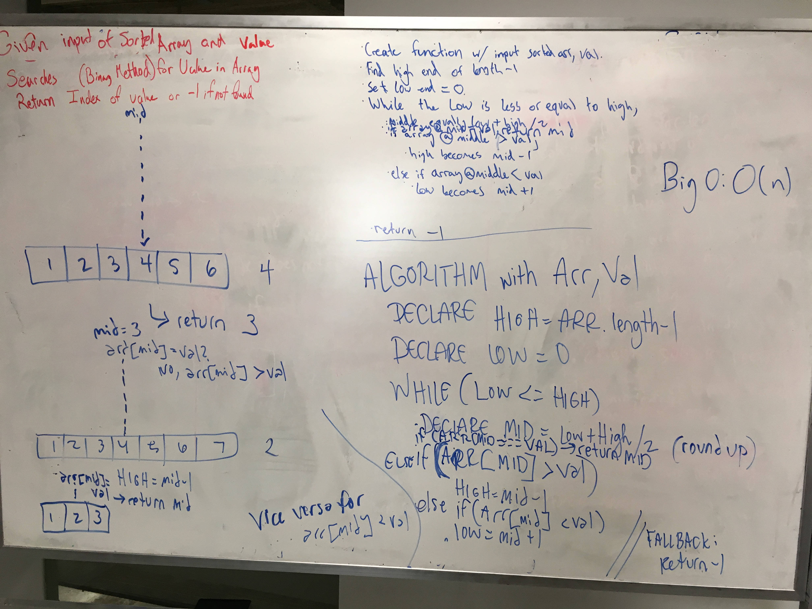

## Code Challenge 03: Array Binary Search
[PR](https://github.com/charmedsatyr-401-advanced-javascript/data-structures-and-algorithms/pull/4)

[travis](https://travis-ci.org/charmedsatyr-401-advanced-javascript/data-structures-and-algorithms)

# Array Binary Search
Return the index of an element in an array if it exists, else -1. Use a binary search method to find your result.

## Challenge
Write a function called BinarySearch which takes in 2 parameters: a sorted array and the search key. Without utilizing any of the built-in methods available to your language, return the index of the array’s element that is equal to the search key, or -1 if the element does not exist.

## Approach & Efficiency
Our group declared variables `high`, `low`, and `mid`. In a `while` loop, we check if the `mid` value matches the target `val`. If it does not, we update our `high` and `low` values to virtually "split" the array into halves, until `low <= high`. Once `arr[mid] === val`, we return `mid`. If the `while` loop completes without locating a match for the target `val`, we return `-1`.

This solution has a time/space efficiency of O(log n).

## Solution
