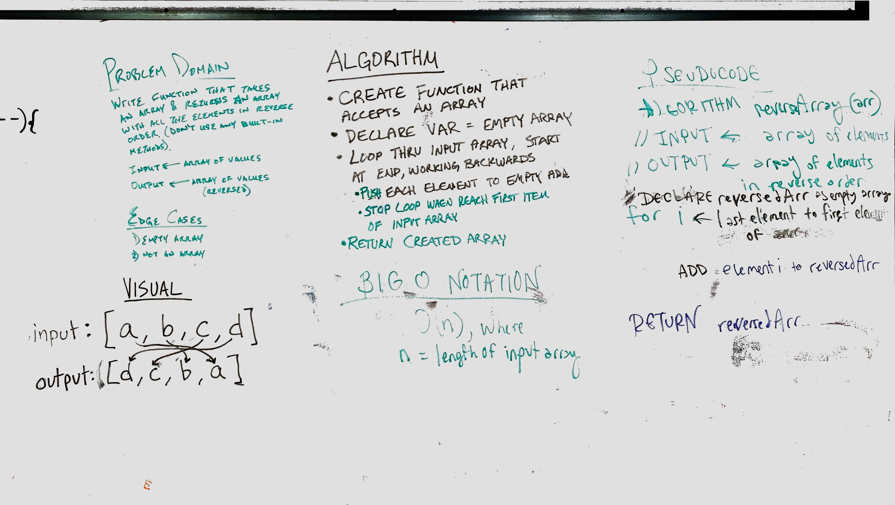

## Code Challenge 01: Reverse an Array

# Reverse an Array
Create a function that reverses the order of the elements in an array.

## Challenge
Write a function called reverseArray which takes an array as an argument. Without utilizing any of the built-in methods available to your language, return an array with elements in reversed order.

## Approach & Efficiency
Our group opted to loop through the input array from the end to the beginning, pushing each element into an empty array.

This approach creates a pure function, manipulates each array element only once, and does not use prohibited built-in methods.

This solution has a time/space complexity of O(n), where n is the length of the input array.

My code uses a `for` loop for iteration.

## Solution

