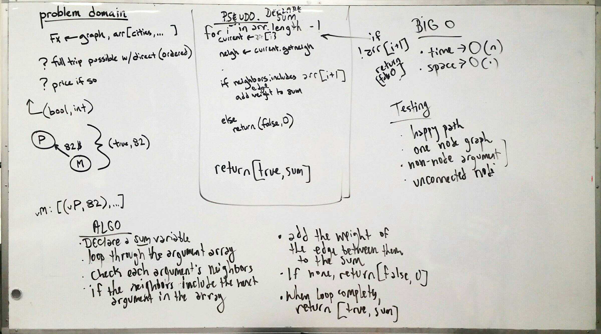

## Code Challenge 32: Get Edges
[PR](https://github.com/charmedsatyr-401-advanced-javascript/data-structures-and-algorithms/pull/23)

# Get Edges
Given a business trip itinerary, and an Alaska Airlines route map, is the trip possible with direct flights? If so, how much will the total trip cost be?

## Challenge
* Write a function based on the specifications above, which takes in a graph, and an array of city names. Without utilizing any of the built-in methods available to your language, return whether the full trip is possible with direct flights, and how much it would cost.

## Approach & Efficiency
This algorithm declares a sum variable and then loops through the array of vertices or nodes given, where each node represents a city. For each node in the array, it checks connected nodes (neighbors) to see if the next node in the array is among them. If it is, the sum is incremented by the value of the edge's weight (in this problem domain, the weight represents the cost of a flight). If it's not, a falsy response is returned with the number 0. If the loop over the array argument completes, a truthy response is returned with the sum of the edge weights.

This approach has a Big O notation of O(n) for time and O(1) for space.

## API
`getGraph` -> Array of [Boolean, number]

## Solution

