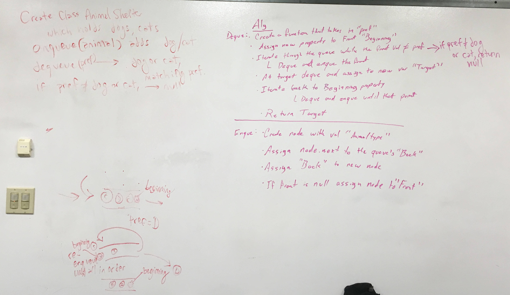

## Code Challenge 13: Multi-Bracket Validation
[PR](https://github.com/charmedsatyr-401-advanced-javascript/data-structures-and-algorithms/pull/13)

# Multi-Bracket Validation
Return a Boolean representing whether or not the brackets in a string are balanced. 

## Challenge
* Create a function that takes a string as its only argument and returns a Boolean representing whether or not the brackets in the string are balanced. There are 3 types of brackets:
  * Round Brackets : ()
  * Square Brackets : []
  * Curly Brackets : {}

## Approach & Efficiency
* My approach was to create a stack as a helper data structure because stacks use a FILO model.
* The function takes a string
* `enqueue(animal)`: Adding an animal to the back of the animal shelter was a matter of instantiating a new instance of `node` with the `animal` data and reassigning pointers in place to place it at the back of the line in the animal shelter and then deal with edge cases as needed. This approach has a time/space efficiency of O(1).
* `dequeue(pref)`: We gave the `first` node in the queue an `initial` property and examined its `data`. If it did not match the `pref`, it was removed from the animal shelter and re-`enqueue`d at the back of the line. When the `first` node's data matched `pref`, the node was removed from the queue, and the data was returned. When the target was found, it was stored in the variable `target` and removed from the animal shelter. We then iterated through the animal shelter again, re-enqueuing the front nodes until the initial order had a `initial` property, at which point the `initial` property was deleted and the `target.data` was returned. Edge cases were handled separately.

This solution has a Big O notation efficiency of O(n) for time and O(1) for space.

Note that the order of animals in the shelter might be different after a `dequeue`. A better solution might have been to iterate from the front to the back of the line with two variables, `current` and `current.next`. Once `current.next.data` equaled the `pref`, the target value would be saved in a `target` variable, `current`'s `next` property would be assigned to `current.next.next`, and `target` would be returned.

## Solution

