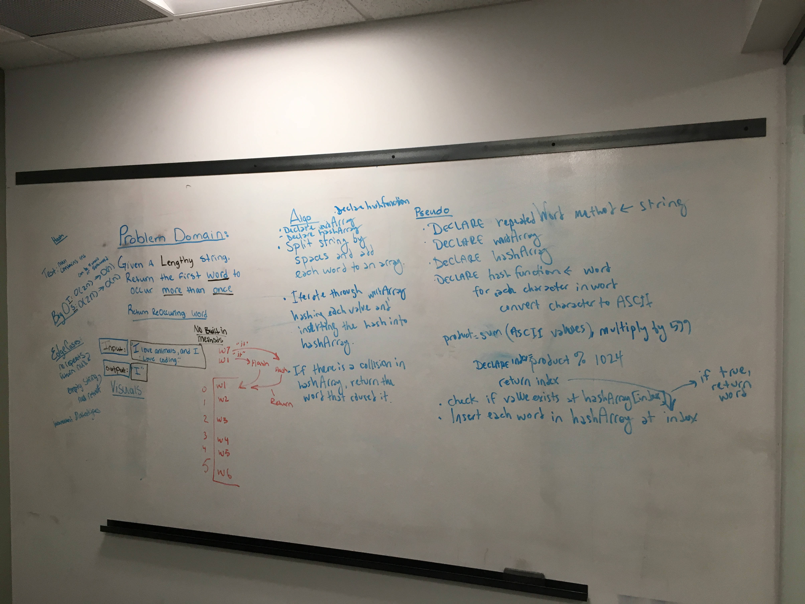

## Code Challenge 26: First Repated Word
[PR](https://github.com/charmedsatyr-401-advanced-javascript/data-structures-and-algorithms/pull/22)

# First Repeated Word
Find the first repeated word in a book.

## Challenge
* Write a function that accepts a lengthy string parameter.
* Without utilizing any of the built-in library methods available to your language, return the first word to occur more than once in that provided string.

## Approach & Efficiency

* I use a `hash` function and a `repeatedWord` function.
* The `hash` function converts a word to ASCII character codes, sums the codes, multiplies them by 599, and returns the rounded-down remainder of that product divided by 1024.
* In `repeatedWord`, the string input is split into an array at each space. A hashmap of 1024 linked lists is created. For each word in the array, the word is lowercased and parsed for letters. Then, it is hashed using the `hash` function, and the linked list at the index corresponding to the hash is checked to see if the word is included. If it is, the word is returned; otherwise, the word is added to that linked list. If no matches are found, `null` is returned.

This solution has a Big O notation efficiency of O(n^2) for time (in the unlikely event that every word in the input is a collision without being a repeat) and O(n) for space.

## API
`hash(word)` -> `Number`

`repeatedWord(string)` -> a word or `null`

## Solution

