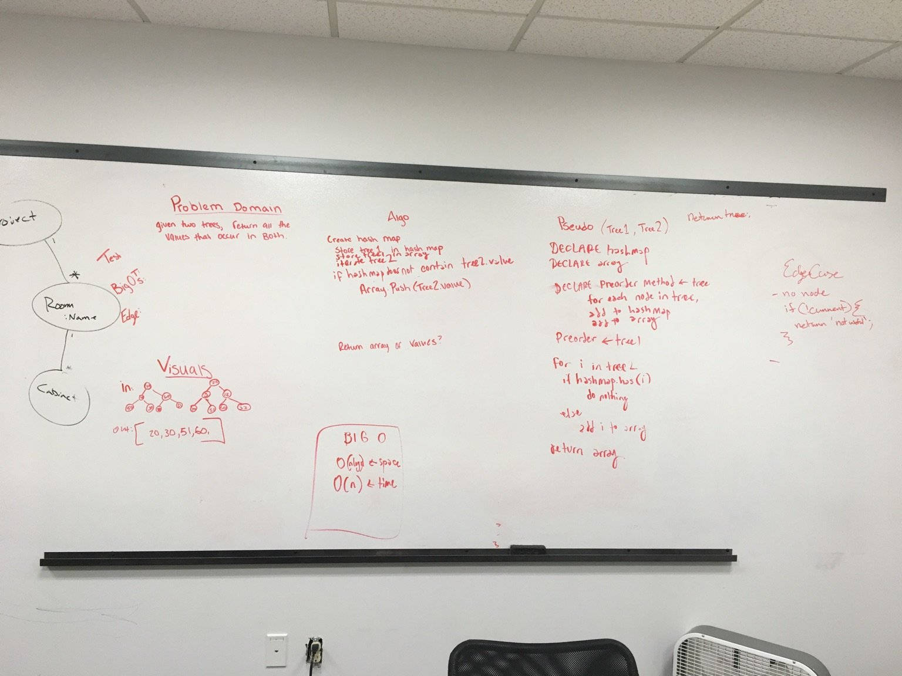

## Code Challenge 27: Tree Intersection
[PR](https://github.com/charmedsatyr-401-advanced-javascript/data-structures-and-algorithms/pull/23)

# Tree Intersection
Find common values in 2 binary trees.

## Challenge
* Write a function called `tree_intersection` that takes two binary tree parameters.
* Without utilizing any of the built-in library methods available to your language, return a set of values found in both trees.

## Approach & Efficiency
* I wrote a new [`HashTable` class](../../data-structures/hashtable/better-hash-table.js) with [tests](../../data-structures/hashtable/__tests__/better-hash-table.test.js) that has `add(value)`, `has(value)`, `hash(value)`, and `print()` methods. This version of the hash table handles collisions but does *not* store duplicate values.
* Within my `treeIntersection` function, I create a new instance of `HashTable` and an `addPreOrder` method that adds the data from a binary tree to the has table via a pre-order traversal.
* I then use the `print` method of my hash table to print the intersection of the two tables.
* This solution has a Big O notation efficiency of O(n^2) for time (in the unlikely event that every word in the input is a collision without being a repeat) and O(n log n) for space (due to the call stack).

## API
`treeIntersection(tree1, tree2)` -> `Array`

## Solution

