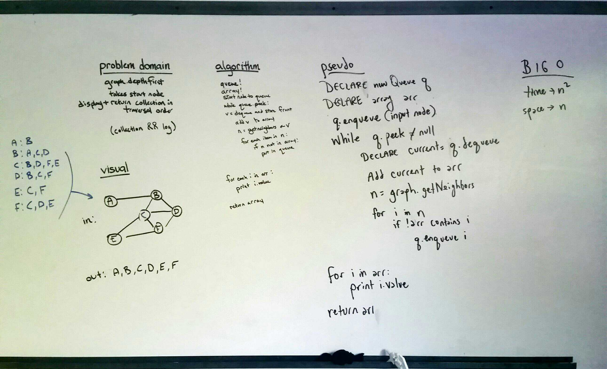
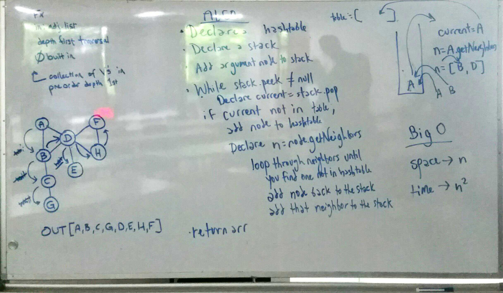

# Code: Graph
* [PR](https://github.com/charmedsatyr-401-advanced-javascript/data-structures-and-algorithms/pull/26)
* [PR - Depth First](https://github.com/charmedsatyr-401-advanced-javascript/data-structures-and-algorithms/pull/28)
* 

### Graph
* Implement a Graph.
* Breadth First Traversal
* Conduct a depth first preorder traversal on a graph

## Challenges
### Graph
Implement your own Graph. The graph should be represented as an adjacency list, and should include the following methods:
* `AddNode()`
  * Adds a new node to the graph
  * Takes in the value of that node
  * Returns the added node
* `AddEdge()`
  * Adds a new edge between two nodes in the graph
  * Include the ability to have a “weight”
  * Takes in the two nodes to be connected by the edge
  * Both nodes should already be in the Graph
* `GetNodes()`
  * Returns all of the nodes in the graph as a collection (set, list, or similar)
* `GetNeighbors()`
  * Returns a collection of nodes connected to the given node
  * Takes in a given node
  * Include the weight of the connection in the returned collection
* `Size()`
  * Returns the total number of nodes in the graph
### Breadth First Traversal
* Extend your graph object with a breadth-first traversal method that accepts a starting node. Without utilizing any of the built-in methods available to your language, return a collection of nodes in the order they were visited. Display the collection.

### Depth First Traversal
* Create a function that accepts an adjacency list as a graph, and conducts a depth first traversal. Without utilizing any of the built-in methods available to your language, return a collection of nodes in their pre-order depth-first traversal order.

## Approach & Efficiency
* Graph: I created `Node` and `Edge` classes. The `Node` takes a `data` property and the `Edge` takes `node` and `weight` properties. A `Graph` class uses a JavaScript `Map` as an adjacency list and employs that structure's methods to implement the required functions. The `Graph` class has the following methods:

  * `addNode(data)`
  * `addDirectedEdge(start, end, weight)`
  * `addUndirectedEdge(a, b, weight)`
  * `getNodes()`
  * `getNeighbors(node)`
  * `size()`
  Most methods have an efficiency of O(1) for time and space. `getNodes` has an efficiency of O(n) for both.
* Breadth First: Uses a queue to iterate through each node's neighbors. O(n^2) for time and O(n) for space.
* Depth First: Uses a hashtable and a stack to iterate through each node's neighbors in preorder. O(n) for space and O(n^2) for time.

## API
* `addNode(data)` → added node
* `addDirectedEdge(start, end, weight)` → new instance of `Edge` or `null`
* `addUndirectedEdge(a, b, weight)` → array of `Edge` instances
* `getNodes()` → array of nodes
* `getNeighbors(node)` → array of edges
* `size()` → number
* `breadthFirst` → array of nodes; logs the array
* `depthFirst` → array of nodes

## Whiteboard

### Breadth First Traversal

### Depth First Traversal

