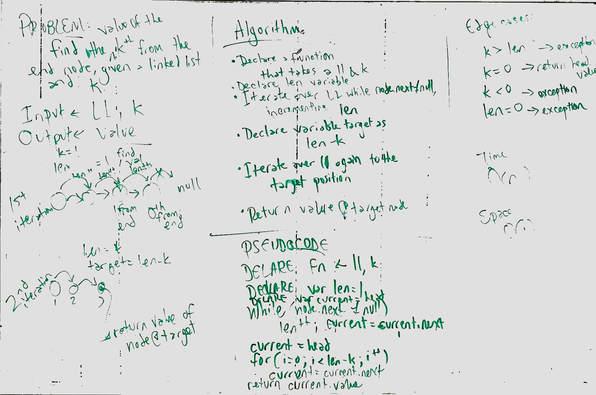

# Code: Linked Lists
[PR for 'Implement a Linked List'](https://github.com/charmedsatyr-401-advanced-javascript/data-structures-and-algorithms/pull/6)

[PR for 'Linked List Insertions'](https://github.com/charmedsatyr-401-advanced-javascript/data-structures-and-algorithms/pull/7)

[PR for 'Find k-th from End'](https://github.com/charmedsatyr-401-advanced-javascript/data-structures-and-algorithms/pull/8)

### Implement a Linked List
* Implement a linked list using JavaScript classes.
### Linked List Insertions
* Implement `insert`, `insertAfter`, and `insertBefore` methods for your `LinkedList` class.
### Find k-th from End
* Implement `kthFromEnd` method for your `LinkedList` class.

## Challenge
### Implement a Linked List
* Create a `Node` class that has properties for the value stored and a pointer to the next node.
* Create a `LinkedList` class with a method `insert` that can instantiate a new node with given data, a method `includes` that returns a Boolean for whether an argument value is stored in a node on the linked list, and a `print` method that takes no arguments and returns a collection of all current node values on the linked list.
### Linked List Insertions
Write the following methods for the LinkedList class:
* `append(value)`, which adds a new node with the given value to the end of the list.
* `insertBefore(value, newVal)`, which add a new node with the given newValue immediately before the first value node
* `insertAfter(value, newVal)` which add a new node with the given newValue immediately after the first value node
### Find k-th from End
* Write a method for `LinkedList` class to find the k-th value from the end of the linked list.

## Approach & Efficiency
### Implement a Linked List
* I created a class `Node` and a class `LinkedList` with the specified properties.
* `insert(value)` reassigns the `head` value of the `LinkedList` instance to that of a new instance of `Node`, avoiding iteration through the chain of nodes in the linked list. It has a space/time efficiency of O(1).
* `includes(value)` may iterate through the entire chain of nodes on the linked list to find a match to a given argument, but it only returns a Boolean. It has a time efficiency of O(n) and a space efficiency of O(1).
* `print()` may iterate through the entire chain of nodes on the linked list to add the node's data to a returned `collection`. It has a time efficiency of O(n) and, because it creates a copy of all the data in the linked list, a space efficiency of O(n).
### Linked List Insertions
* `append(value)` creates a new node from the given value and iterates through the linked list until it finds a `null` pointer to indicate the end of the list, at which point it adds the new node to the linked list. This method has a time efficiency of O(n) and a space efficiency of O(1).
* `insertBefore(value, newVal)` creates a new node from the second argument and iterates through the linked list keeping track of a `leadNode` and a `currentNode`. When the `leadNode`'s value equals the value of the first argument, the new node is inserted after the `currentNode`. This method has a time efficiency of O(n) and a space efficiency of O(1). 
* `insertAfter(value, newVal)` creates a new node from the second argument and iterates through the linked list keeping track of the value of a `currentNode`. When the `currentNode`'s value equals the value of the first argument, the new node is insert after the `currentNode`. This method has a time efficiency of O(n) and a space efficiency of O(1).
### Find k-th from End
* `kthFromEnd(k)` takes a value and declares a variable `len`. It first iterates through the instance of `LinkedList` incrementing `len` until the value of `current.next` is `null`, at which point `len` equals the length of the linked list. The method then iterates through the linked list to the `len - k` node and returns its `data`. The method declares exceptions as appropriate. This method has a time efficiency of O(n) and a space efficiency of O(1).

## API
* Each instance of `Node` on the linked list has `data` and `next` properties. `data` stores the node's data, and `next` points to the next node in the linked list. If the node is at the end of the linked list, its `next` value is `null`.
* Each instance of the `LinkedList` class includes a `head` property initially set to `null` and has six methods: `insert`, `includes`, `print`, `append`, `insertBefore`, `insertAfter`, and `kthFromEnd`.

  * `insert(val)` takes a value argument and creates a new instance of `Node` with that value as the node's `data`. `insert` updates the `head` property of its parent instance of `LinkedList` to the new node.
  * `includes(val)` takes a value and returns `true` if the value exists in an instance of `Node` on the linked list and `false` if it doesn't.
  * `print()` returns an object with position/data key/value pairs for each instance of `Node` stored on the LinkedList. Keys in the returned object correspond to each node's 0-based position in the linked list.
  * `append(val)` takes a value and adds that value as the data of a new node at the end of the linked list.
  * `insertBefore(value, newVal)` takes a value to match and a new value to add. It finds the first node with data that matches the `value` argument and inserts a new instance of `Node` with the data `newVal` before it.
  * `insertAfter(value, newVal)` takes a value to match and a new value to add. It finds the first node with data that matches the `value` argument and inserts a new instance of `Node` with the data `newVal` after it.
  * `kthFromEnd(k)` takes a number,`k`, as a parameter and returns the value of the node that is `k` from the end of the linked list. 

## Whiteboards
### Linked List Insertions (with Andrew Roska)

### Find k-th from End (with Andrew Roska)

