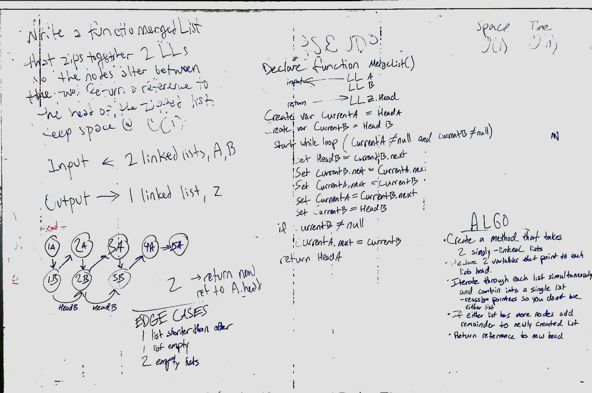

# Code: Linked Lists
* [PR](https://github.com/charmedsatyr-401-advanced-javascript/data-structures-and-algorithms/pull/9)
* 

### Merge Two Linked Lists
* Zip together two linked lists so the new list's nodes alternate between the two.

## Challenge
### Merge Two Linked Lists
* Write a function `mergeLists` that zips together two linked lists so the nodes alter between the two. Return a reference to the head of the zipped list. Keep space efficiency at O(1).

## Approach & Efficiency
* `mergeLists` takes two linked lists `a` and `b`. It declares two variables `currentA` and `currentB` pointing to each list's head. It handles some edge cases then iterates through the two lists in a `while` loop while both `currentA.next` and `currentB.next` are not `null`. In the loop, it first advances each `b.head` to `currentB.next` and then begins reassigning `a` and `b` nodes' `next` pointers to point to a pair node on the other list, keeping nodes from `a` first in order. Once either `currentA.next` or `currentB.next` is `null`, the loop is complete, and any remaining nodes from `b` are added to the end of the result. `a.head`, the head of the resulting list, is returned.

This method has a time efficiency of O(n) and a space efficiency of O(1).

## API
* `mergedList` assumes that each instance of `LinkedList` has a `head` property that references either `null` or an instance of `Node` that has `next` property. It takes two such instances of `LinkedList` as arguments and returns a reference to the `head` of the new linked list.

## Whiteboard
### Merge Two Linked Lists (with Andrew Roska)

