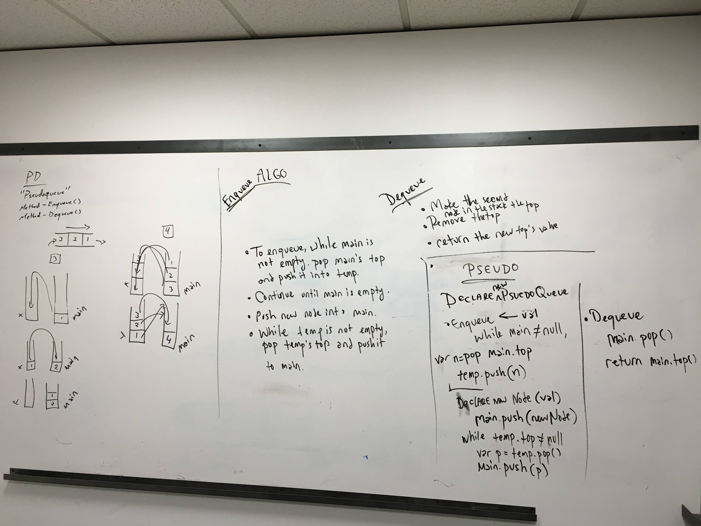

# Code: Queues with Stacks
* [PR](https://github.com/charmedsatyr-401-advanced-javascript/data-structures-and-algorithms/pull/11)
* 

### Queues with Stacks
* Create a brand new `PseudoQueue` class.

## Challenges
### Queue with Stacks
* Create a brand new `PseudoQueue` class. Do not use an existing `Queue`. Instead, this `PseudoQueue` class will implement our standard queue interface (the two methods listed below), but will internally only utilize 2 `Stack` objects. Ensure that you create your class with the following methods:

  * `enqueue(value)` which inserts value into the PseudoQueue, using a first-in, first-out approach.
  * `dequeue()` which extracts a value from the PseudoQueue, using a first-in, first-out approach.

The Stack instances have only `push`, `pop`, and `peek` methods. You should use your own `Stack` implementation. Instantiate these `Stack` objects in your `PseudoQueue` constructor.

## Approach & Efficiency
### PseudoQueue
* Each instance of `PseudoQueue` is instantiated with two instances of `Stack` in its constructor, `main` and `temp`. Both `main` and `temp` have `push`, `pop`, and `peek` methods.
* `enqueue(val)` adds a new node with the value `val` to the bottom of the `main` stack. It starts at the top of the `main` stack, moves all the nodes one by one onto `temp` using a `current` placeholder variable and the stacks' `push` and `pop` methods, adds the new node with value `val` to the empty stack `main` with `push`, and then moves all the nodes from `temp` one by one back onto `main` in the same way. This approach has a time efficiency of O(n) and a space efficiency of O(1).

* `dequeue` returns the value from `main`'s `pop` method if `main.top` is not `null`; otherwise, it returns `null`. This method has a time efficiency of O(1) and a space efficiency of O(1).

## API
### Queue
* `.enqueue(val)` -> `undefined`
* `.dequeue()` -> `data`

## Whiteboard

